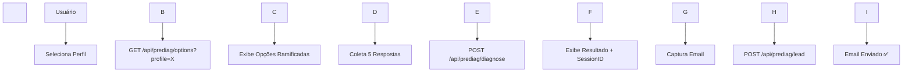

\# 🎯 Documentação: Página Pré-Diagnóstico


\## 📋 Visão Geral


Interface conversacional mobile-first que simula um chat para capturar dados do usuário e processar o pré-diagnóstico ROI do Foco.


```

Rota: /pre-diagnostico

Arquivo: src/app/pre-diagnostico/page.tsx  

Tipo: Client Component (useState/useEffect)

Design: Mobile-first, conversacional, glass-effect

```


---


\## 🏗️ Arquitetura da Página


\### Estrutura de Componentes

```

PreDiagnosticoPage (page.tsx)

├── Header Fixo

├── Intro Section  

├── ChatFlow (componente principal)

└── Footer Discreto

```


\### Design System

```typescript

// Usa tokens centralizados

import { DESIGN\_TOKENS } from '@/lib/design-system';


// Background: DESIGN\_TOKENS.colors.background (#0a0a0b)

// Primary: DESIGN\_TOKENS.colors.primary (#d97706)

// Glass Effect: backdrop-blur + bg-black/20

```


---


\## 🎨 Header Fixo (Sticky)


```typescript

<header className="sticky top-0 z-50 px-4 py-3 border-b border-white/10 backdrop-blur-md bg-black/20">

```


\### Elementos

\- \*\*Botão Voltar\*\*: Link para `/` com ícone ArrowLeft

\- \*\*Logo/Título\*\*: "Pré-Diagnóstico" com ícone Coffee

\- \*\*Espaçador\*\*: Para simetria visual


\### Responsividade

\- \*\*Desktop\*\*: Mostra texto "Voltar"  

\- \*\*Mobile\*\*: Só ícone para economizar espaço


---


\## 💬 Seção Intro


```typescript

<div className="inline-flex items-center gap-2 px-4 py-2 rounded-full bg-white/5 border border-white/10 mb-4">

&nbsp; <div className="w-2 h-2 rounded-full animate-pulse" style={{ backgroundColor: DESIGN\_TOKENS.colors.primary }}></div>

&nbsp; <span className="text-white/80 text-sm">Demo gratuita • 2-3 minutos</span>

</div>

```


\### Features

\- \*\*Badge Status\*\*: "Demo gratuita • 2-3 minutos" com indicador pulsante

\- \*\*Descrição\*\*: Explica brevemente o que será feito

\- \*\*Glass Effect\*\*: Elemento visual com transparência e blur


---


\## 🗨️ ChatFlow (Componente Principal)


\*\*Importação\*\*: `import { ChatFlow } from '@/components/prediagnostico/ChatFlow';`


Este é o coração da experiência. Embora não tenhamos o código do componente aqui, pela estrutura das APIs podemos inferir seu fluxo:


\### Fluxo Esperado

1\. \*\*Pergunta 1\*\*: Seleção de perfil profissional

2\. \*\*Pergunta 2\*\*: Como está sua agenda? (opções de AGENDA)  

3\. \*\*Pergunta 3\*\*: Principal dor/desafio (ramificado por perfil)

4\. \*\*Pergunta 4\*\*: Atividade que mais consome tempo (ramificado por perfil)

5\. \*\*Pergunta 5\*\*: Principal objetivo/goal (ramificado por perfil)

6\. \*\*Processamento\*\*: POST para `/api/prediag/diagnose`

7\. \*\*Resultado\*\*: Exibe snapshot + insight + botão para email

8\. \*\*Captura Email\*\*: POST para `/api/prediag/lead`


\### Integração com APIs

```typescript

// 1. Buscar opções por perfil

const response = await fetch(`/api/prediag/options?profile=${selectedProfile}`);


// 2. Processar diagnóstico  

const diagResponse = await fetch('/api/prediag/diagnose', {

&nbsp; method: 'POST',

&nbsp; body: JSON.stringify({ profile, agenda, pain, topActivity, goal })

});


// 3. Capturar lead + enviar email

const leadResponse = await fetch('/api/prediag/lead', {

&nbsp; method: 'POST', 

&nbsp; body: JSON.stringify({ email, sessionId })

});

```


---


\## 🎨 Estilos Globais Inline


\### Estratégia CSS-in-JS

A página usa `<style jsx global>` para garantir que os estilos funcionem independente do framework:


```css

/\* Previne scroll horizontal \*/

html, body {

&nbsp; overflow-x: hidden;

&nbsp; background-color: ${DESIGN\_TOKENS.colors.background};

}


/\* Smooth scroll \*/

html { scroll-behavior: smooth; }


/\* Melhora tap targets mobile (Apple HIG) \*/  

@media (hover: none) and (pointer: coarse) {

&nbsp; button, \[role="button"], a {

&nbsp;   min-height: 44px;

&nbsp;   min-width: 44px;

&nbsp; }

}

```


\### Classes Utilitárias

```css

/\* Animações de entrada \*/

.fade-in { animation: fadeIn 0.3s ease-in-out; }

.chat-message { animation: slideInLeft 0.4s ease-out; }


/\* Botões de opção (para ChatFlow) \*/

.option-button {

&nbsp; background: rgba(255, 255, 255, 0.08);

&nbsp; border: 1px solid rgba(255, 255, 255, 0.15);

&nbsp; backdrop-filter: blur(8px);

&nbsp; transition: all 0.2s ease;

}


.option-button:hover {

&nbsp; background: rgba(255, 255, 255, 0.12);

&nbsp; border-color: ${DESIGN\_TOKENS.colors.primary};

&nbsp; transform: translateY(-1px);

}

```


---


\## 📱 Responsividade


\### Breakpoints

\- \*\*Mobile\*\*: < 640px - Layout stack, botões full-width

\- \*\*Tablet\*\*: 640-1024px - Container médio, grid 2 colunas  

\- \*\*Desktop\*\*: > 1024px - Container max-width, elementos centralizados


\### Container Principal

```typescript

<div className="max-w-2xl mx-auto px-4">

&nbsp; // Máximo 600px em desktop

&nbsp; // Padding lateral 16px em mobile

</div>

```


\### Ajustes Mobile

```css

@media (max-width: 640px) {

&nbsp; .option-button {

&nbsp;   padding: 0.875rem 1rem;      // Mais padding para touch

&nbsp;   font-size: 0.95rem;           // Texto um pouco menor

&nbsp; }

}

```


---


\## ⚡ Performance \& UX


\### Hidratação Controlada

```typescript

const \[mounted, setMounted] = useState(false);


useEffect(() => {

&nbsp; setMounted(true);

}, \[]);


if (!mounted) {

&nbsp; return <div>Carregando...</div>; // Previne hydration mismatch

}

```


\### Loading States

\- \*\*Initial\*\*: "Carregando..." enquanto componente hidrata

\- \*\*API Calls\*\*: Loading states nos botões durante requests

\- \*\*Smooth Transitions\*\*: Animações suaves entre estados


\### Otimizações

\- \*\*Lazy Loading\*\*: Componentes carregados sob demanda

\- \*\*Debounce\*\*: Previne múltiplos cliques acidentais  

\- \*\*Error Boundaries\*\*: Tratamento de erros graceful


---


\## 🔗 Navegação e Links


\### Link de Retorno

```typescript

<Link href="/" className="flex items-center gap-2...">

&nbsp; <ArrowLeft className="w-5 h-5" />

&nbsp; <span className="hidden sm:inline text-sm">Voltar</span>

</Link>

```


\### Footer Links

```typescript

<a 

&nbsp; href="https://conversasnocorredor.substack.com/s/roi-do-foco" 

&nbsp; target="\_blank"

&nbsp; rel="noopener noreferrer"

&nbsp; className="underline hover:text-white/60 transition-colors"

>

&nbsp; ROI do Foco

</a>

```


---


\## 🧪 Estados da Aplicação


\### Estados Possíveis do ChatFlow

1\. \*\*Inicial\*\*: Mostra introdução e primeira pergunta

2\. \*\*Coletando\*\*: Sequência de perguntas (profile → agenda → pain → activity → goal)

3\. \*\*Processando\*\*: Loading durante POST `/diagnose`  

4\. \*\*Resultado\*\*: Exibe mix + insight + CTA email

5\. \*\*Email\*\*: Form de captura de email

6\. \*\*Sucesso\*\*: Confirmação de email enviado

7\. \*\*Erro\*\*: Tratamento de falhas


\### Gerenciamento de Estado

Assumindo que ChatFlow usa useState local:

```typescript

// Estados inferidos baseados no fluxo das APIs

const \[currentStep, setCurrentStep] = useState(0);

const \[answers, setAnswers] = useState({});

const \[diagResult, setDiagResult] = useState(null);

const \[loading, setLoading] = useState(false);

const \[sessionId, setSessionId] = useState(null);

```


---


\## 🎯 Integração com Backend


\### Fluxo de Dados


```mermaid

graph TD

&nbsp;   A\[Usuário] --> B\[Seleciona Perfil]

&nbsp;   B --> C\[GET /api/prediag/options?profile=X]

&nbsp;   C --> D\[Exibe Opções Ramificadas]

&nbsp;   D --> E\[Coleta 5 Respostas]

&nbsp;   E --> F\[POST /api/prediag/diagnose]

&nbsp;   F --> G\[Exibe Resultado + SessionID]

&nbsp;   G --> H\[Captura Email]

&nbsp;   H --> I\[POST /api/prediag/lead]

&nbsp;   I --> J\[Email Enviado ✅]

```


\### Error Handling

```typescript

// Exemplo de tratamento de erro

try {

&nbsp; const response = await fetch('/api/prediag/diagnose', { ... });

&nbsp; if (!response.ok) throw new Error('Falha no diagnóstico');

&nbsp; const data = await response.json();

&nbsp; setDiagResult(data.resultado);

&nbsp; setSessionId(data.sessionId);

} catch (error) {

&nbsp; setError('Não foi possível processar o diagnóstico. Tente novamente.');

}

```


---


\## 🚀 Deploy e Configuração


\### Dependências

```json

{

&nbsp; "dependencies": {

&nbsp;   "next": "^14.0.0",

&nbsp;   "react": "^18.0.0", 

&nbsp;   "lucide-react": "^0.xxx",

&nbsp;   "@/lib/design-system": "local",

&nbsp;   "@/components/prediagnostico/ChatFlow": "local"

&nbsp; }

}

```


\### Variáveis de Ambiente

As APIs que a página consome precisam de:

```bash

SUPABASE\_URL=https://xxx.supabase.co

SUPABASE\_ANON\_KEY=eyJxxx

RESEND\_API\_KEY=re\_xxx

EMAIL\_FROM\_ADDRESS=noreply@conversasnocorredor.com

```


\### Build e Deploy

```bash

npm run build   # Deve compilar sem erros

npm run start   # Testar SSR

npm run dev     # Desenvolvimento

```


---


\## 📊 Analytics e Tracking


\### Eventos Relevantes

\- \*\*Page Load\*\*: Usuário acessa `/pre-diagnostico`

\- \*\*Step Progress\*\*: Cada resposta coletada

\- \*\*Diagnosis Complete\*\*: POST `/diagnose` sucesso

\- \*\*Email Submitted\*\*: POST `/lead` sucesso

\- \*\*Conversion\*\*: Email enviado com sucesso


\### Integração com Supabase

A página alimenta as tabelas de analytics via APIs:

\- `roi\_prediag\_sessions`: Dados do diagnóstico

\- `roi\_leads`: Emails capturados  

\- `roi\_events`: Eventos de conversão


\### Monitoramento

\- \*\*Performance\*\*: Core Web Vitals via Vercel

\- \*\*Errors\*\*: Error boundaries + Sentry (se configurado)  

\- \*\*Conversion Rate\*\*: Via dashboard Supabase

